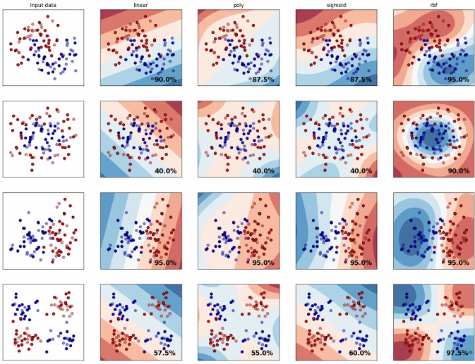
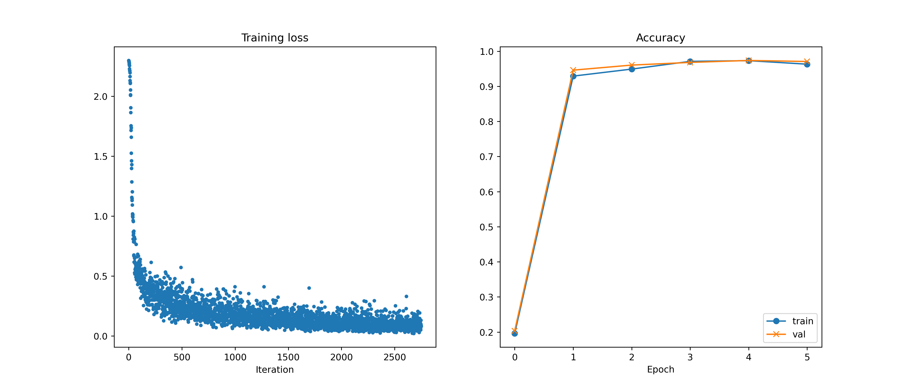

# 🧠 Machine Learning Models from Scratch

This repository showcases a series of core machine learning models and training utilities implemented entirely from scratch using **NumPy** and **CVXOPT**. It covers both **Support Vector Machines (SVMs)** — in primal and dual forms — and a **modular two-layer neural network** framework. The implementation avoids using high-level machine learning libraries to provide a deeper understanding of how these models work under the hood.

---

## 🚀 Highlights

- ✅ Batch Gradient Descent for Soft-Margin SVM (Primal)
- ✅ Dual-Form SVM solved using Quadratic Programming (CVXOPT)
- ✅ Fully connected Two-Layer Neural Network (fc → ReLU → fc → Softmax)
- ✅ Modular training engine with custom optimization
- ✅ Gradient checking for debugging backpropagation
- ✅ All implemented with **NumPy only** (except CVXOPT for dual SVM)

---

## 📁 Project Structure

```
├── soft_margin_svm.py           # SVM (primal form with gradient descent)
├── cvxopt_svm.py                # Kernelized SVM using CVXOPT QP solver
├── two_layer_net.py             # Neural network module (forward/backward)
├── solver.py                    # Training loop engine for neural networks
├── optim.py                     # Optimizers (e.g., SGD)
├── gradient_check.py            # Numerical gradient checking utilities
├── *.ipynb                      # Jupyter notebooks demonstrating each model
```

---

## 📦 Components

### 🔹 1. Soft-Margin SVM (Primal Form)

**Files**: `soft_margin_svm.py`, `soft_margin_svm.ipynb`  
Implements a soft-margin SVM using **batch gradient descent** to minimize hinge loss with L2 regularization.

```python
W, b = svm_train_bgd(X_train, y_train, num_epochs=100, C=5.0, eta=0.001)
accuracy = svm_test(W, b, X_test, y_test)
```

✅ Vectorized gradient updates  
✅ Slack penalty (C) support  
✅ Returns trained weights & accuracy

---

### 🔹 2. CVXOPT SVM (Dual Form + Kernelized)
This figure illustrates the decision boundaries of SVMs trained with different kernel functions (`linear`, `polynomial`, `sigmoid`, and `RBF`) across various synthetic datasets. Each subfigure shows the classification accuracy.



- Rows represent different data distributions.
- Columns show decision boundaries from different kernels.
- The RBF kernel adapts well to non-linear decision surfaces and performs consistently better on complex datasets.

---

**Files**: `cvxopt_svm.py`, `cvxopt_svm.ipynb`  
Formulates the SVM as a **convex quadratic programming** problem and solves it using `cvxopt`.

```python
    def fit(self, X, y):
        # Initialize and computing H. Note the 1. to force to float type
        y = y * 2 - 1  # transform to [-1, 1]
        self.classes_ = [-1, 1]
        self.X_train = X.copy()
        self.y_train = y.copy()

        # Convert into cvxopt format
        _P, _q, _G, _h, _A, _b = get_qp_params(X, y, self.C, self.kernel_params)
        P = cvxopt_matrix(_P)
        q = cvxopt_matrix(np.expand_dims(_q, 1))
        G = cvxopt_matrix(_G)
        h = cvxopt_matrix(_h)
        A = cvxopt_matrix(_A)
        b = cvxopt_matrix(_b)

        # Run solver
        cvxopt_solvers.options['show_progress'] = False
        try:
            sol = cvxopt_solvers.qp(P, q, G, h, A, b)
        except ValueError:
            # if fail to solve, try different solver
            # default solver always fails on windows cvxopt build
            sol = cvxopt_solvers.qp(P, q, G, h, A, b, kktsolver='ldl', options={'kktreg':1e-9})
        self.alpha = np.array(sol['x']).squeeze(1)

        self.support_ = np.where(self.alpha > 1e-4)
        self.b = fit_bias(X, y, self.alpha, self.kernel_params)

        return self
```

✅ Supports kernels: `'linear'`, `'rbf'`, `'poly'`, `'sigmoid'`  
✅ Solves dual QP with kernel trick  
✅ Supports margin visualization in notebook

---

### 🔹 3. Two-Layer Neural Network

This visualization demonstrates the training dynamics of the two-layer neural network, including the convergence of training loss and validation accuracy over epochs.



- **Left**: Training loss decreases rapidly during early iterations, then gradually stabilizes.
- **Right**: Accuracy approaches ~95% for both training and validation sets, indicating good generalization.

---
**Files**: `two_layer_net.py`, `solver.py`, `optim.py`, `two_layer_net.ipynb`  
Implements a two-layer neural network with modular forward/backward passes and a training framework.

```python
    def __init__(self, input_dim=28*28, hidden_dim=100,
                 num_classes=10, weight_scale=1e-3):
        """
        Initialize a new network.
        Inputs:
        - input_dim: An integer giving the size of the input
        - hidden_dim: An integer giving the size of the hidden layer
        - num_classes: An integer giving the number of classes to classify
        - weight_scale: Scalar giving the standard deviation for random
          initialization of the weights.
        """
        self.params = {}
        ############################################################################
        # TODO: Initialize the weights and biases of the two-layer net. Weights    #
        # should be initialized from a Gaussian centered at 0.0 with               #
        # standard deviation equal to weight_scale, and biases should be           #
        # initialized to zero. All weights and biases should be stored in the      #
        # dictionary self.params. Use keys 'W1' and 'b1' for the weights and       #
        # biases of the first fully-connected layer, and keys 'W2' and 'b2' for    #
        # the weights and biases of the output affine layer.                       #
        ############################################################################

        self.params['W1'] = np.random.normal(0.0, weight_scale, (input_dim, hidden_dim))
        self.params['W2'] = np.random.normal(0.0, weight_scale, (hidden_dim, num_classes))
        self.params['b1'] = np.zeros((hidden_dim,))
        self.params['b2'] = np.zeros((num_classes,))
```

🧱 Architecture: fc → ReLU → fc → Softmax  
🔁 Built-in training/validation tracking  
🧪 Compatible with gradient checking

---

### 🔹 4. Gradient Checking

**File**: `gradient_check.py`  
Implements numerical gradient computation via finite differences to verify backpropagation correctness.

```python
from gradient_check import eval_numerical_gradient
grad = eval_numerical_gradient(loss_func, param_array)
```

✅ Works on scalar, vector, or blob-style gradients  
✅ Helps debug forward/backward implementation

---

### 🔹 5. Optimization Utilities

**File**: `optim.py`  
Includes basic optimizers such as **stochastic gradient descent (SGD)**.

```python
from optim import sgd
next_w, config = sgd(w, dw, config={'learning_rate': 1e-2})
```

---

## 🧪 Summary Table

| File                | Description                                      |
|---------------------|--------------------------------------------------|
| `soft_margin_svm.py`| SVM using batch gradient descent (primal form)  |
| `cvxopt_svm.py`     | SVM with kernelization via QP (dual form)       |
| `two_layer_net.py`  | Modular two-layer neural network                |
| `solver.py`         | Training loop for neural network                |
| `optim.py`          | Optimizer utilities (SGD)                       |
| `gradient_check.py` | Finite difference gradient checker              |

---

## 📌 Requirements

- Python 3.7+
- NumPy
- [cvxopt](https://cvxopt.org/) (only for dual-form SVM)

```bash
pip install numpy cvxopt
```

---

## 💻 Getting Started

```bash
git clone https://github.com/your-username/ml-models-from-scratch.git
cd ml-models-from-scratch
```

Run Jupyter notebook for SVM or neural network demos:

```bash
jupyter notebook
```

Run SVM from script:

```bash
python soft_margin_svm.py
```

---

## 🎓 Educational Purpose

This project was developed to **explore and teach the core mechanics of machine learning models** — how gradients, optimization, and classification work at the lowest level. No high-level ML frameworks were used to encourage full control and deeper learning.

- Understand SVM primal vs. dual optimization  
- Visualize classification boundaries and loss  
- Debug gradients with numerical checks  
- Build and train neural networks manually

---

## 👨‍💻 Author

**Hao-Chun Shih (Oscar)**  
Master’s in Data Science, University of Michigan  
📧 oscar10408@gmail.com

---

## 🪪 License

This project is licensed under the [MIT License](https://opensource.org/licenses/MIT). You are free to use, modify, and share this code for personal or educational purposes.
